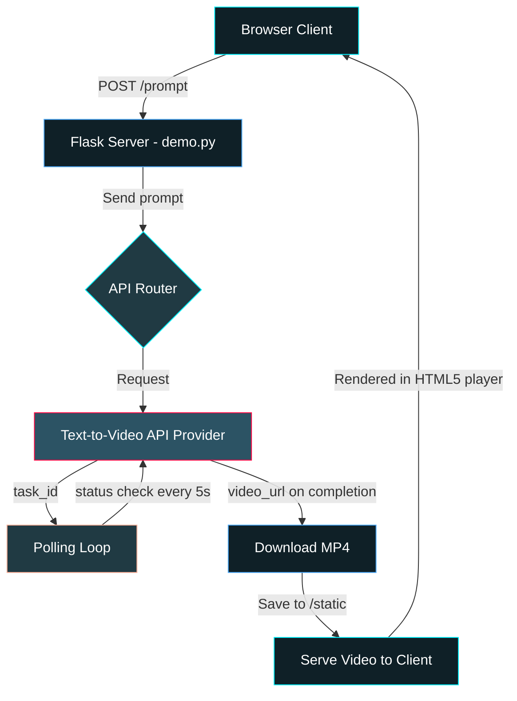
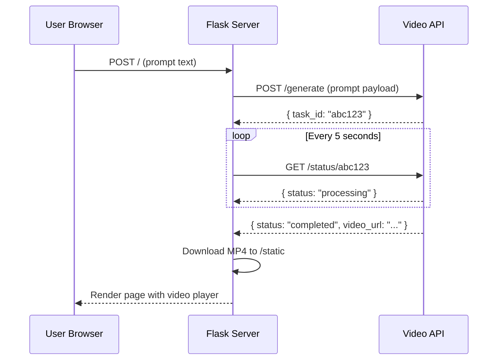
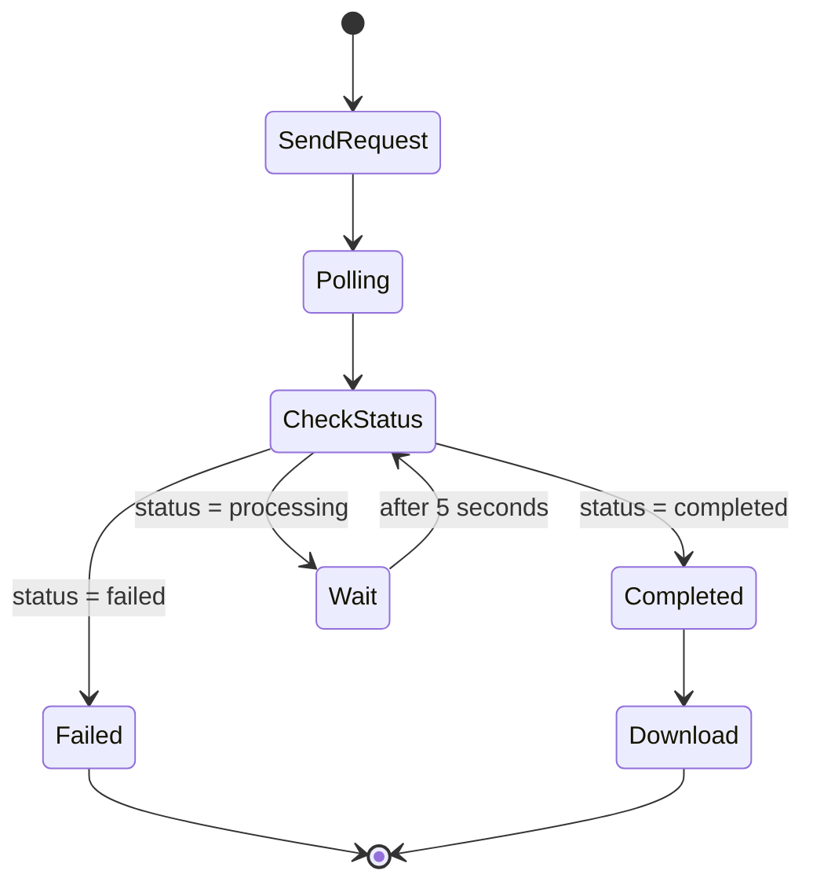
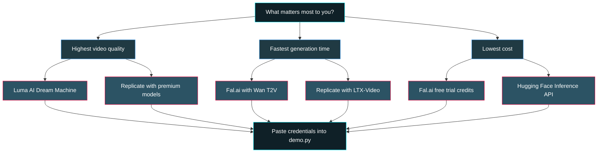

<div align="center">

<svg width="800" height="120" xmlns="http://www.w3.org/2000/svg">
  <defs>
    <linearGradient id="grad1" x1="0%" y1="0%" x2="100%" y2="0%">
      <stop offset="0%" style="stop-color:#00f2fe;stop-opacity:1">
        <animate attributeName="stop-color" values="#00f2fe;#4facfe;#00f2fe" dur="3s" repeatCount="indefinite"/>
      </stop>
      <stop offset="50%" style="stop-color:#4facfe;stop-opacity:1">
        <animate attributeName="stop-color" values="#4facfe;#00f2fe;#4facfe" dur="3s" repeatCount="indefinite"/>
      </stop>
      <stop offset="100%" style="stop-color:#0f2027;stop-opacity:1">
        <animate attributeName="stop-color" values="#0f2027;#2c5364;#0f2027" dur="3s" repeatCount="indefinite"/>
      </stop>
    </linearGradient>
    <linearGradient id="grad2" x1="0%" y1="0%" x2="100%" y2="0%">
      <stop offset="0%" style="stop-color:#ff0844;stop-opacity:1">
        <animate attributeName="stop-color" values="#ff0844;#ffb199;#ff0844" dur="4s" repeatCount="indefinite"/>
      </stop>
      <stop offset="100%" style="stop-color:#ffb199;stop-opacity:1">
        <animate attributeName="stop-color" values="#ffb199;#ff0844;#ffb199" dur="4s" repeatCount="indefinite"/>
      </stop>
    </linearGradient>
  </defs>
  <rect width="800" height="120" rx="15" fill="#0d1117"/>
  <rect x="2" y="2" width="796" height="116" rx="14" fill="none" stroke="url(#grad1)" stroke-width="2">
    <animate attributeName="stroke-dasharray" values="0,1600;800,800;1600,0;800,800;0,1600" dur="6s" repeatCount="indefinite"/>
  </rect>
  <text x="400" y="55" font-family="monospace" font-size="36" font-weight="bold" fill="url(#grad1)" text-anchor="middle">AI VIDEO GENERATOR</text>
  <text x="400" y="90" font-family="monospace" font-size="18" fill="url(#grad2)" text-anchor="middle">ULTRA PRO MAX EDITION</text>
  <circle cx="50" cy="60" r="8" fill="none" stroke="#00f2fe" stroke-width="2">
    <animate attributeName="r" values="5;12;5" dur="2s" repeatCount="indefinite"/>
    <animate attributeName="opacity" values="1;0.3;1" dur="2s" repeatCount="indefinite"/>
  </circle>
  <circle cx="750" cy="60" r="8" fill="none" stroke="#00f2fe" stroke-width="2">
    <animate attributeName="r" values="5;12;5" dur="2s" repeatCount="indefinite"/>
    <animate attributeName="opacity" values="1;0.3;1" dur="2s" repeatCount="indefinite"/>
  </circle>
</svg>

<br>

<table>
<tr>
<td><kbd>Python</kbd></td>
<td><kbd>Flask</kbd></td>
<td><kbd>HTML5</kbd></td>
<td><kbd>CSS3</kbd></td>
<td><kbd>Jinja2</kbd></td>
<td><kbd>REST API</kbd></td>
</tr>
</table>

<br>

**A production-grade text-to-video generation platform built with Flask.**
**Plug in any video AI provider. Zero lock-in. Maximum flexibility.**

---

</div>

## Table of Contents

<details open>
<summary><b>Navigate This Document</b></summary>

| Section | Description |
|---|---|
| [Quick Start](#-quick-start) | Get running in 60 seconds |
| [Architecture](#-architecture) | How the system is built |
| [Interactive Playground](#-interactive-playground) | Explore the codebase hands-on |
| [API Integration Guide](#-api-integration-guide) | Connect any text-to-video provider |
| [File Explorer](#-file-explorer) | Walk through every file |
| [Troubleshooting](#-troubleshooting) | Fix common issues fast |
| [Configuration Matrix](#-configuration-matrix) | All configurable options |
| [Decision Tree](#-decision-tree) | Choose the right API for your needs |

</details>

---

## QUICK START

```
pip install flask requests
```
```
python demo.py
```
```
Open http://127.0.0.1:5000
```

That is it. Three commands. You are live.

---

## ARCHITECTURE



### Request Lifecycle



---

## INTERACTIVE PLAYGROUND

Expand each section below to explore the full codebase interactively. Every file is documented inline.

<details>
<summary><b>demo.py -- The Backend Engine</b></summary>

<br>

<details>
<summary><kbd>SECTION 1</kbd> -- Imports and App Initialization</summary>

```python
import os
import time
import requests
from flask import Flask, render_template, request

app = Flask(__name__)
```

| Import | Purpose |
|---|---|
| `os` | File system operations for saving generated videos |
| `time` | Sleep between API polling intervals |
| `requests` | HTTP client for communicating with external video APIs |
| `Flask` | The web framework powering the entire server |
| `render_template` | Renders Jinja2 HTML templates |
| `request` | Accesses incoming form data from the browser |

</details>

<details>
<summary><kbd>SECTION 2</kbd> -- Route Handler and Prompt Capture</summary>

```python
@app.route("/", methods=["GET", "POST"])
def index():
    video_name = None
    if request.method == "POST":
        prompt = request.form["prompt"]
```

| Line | What It Does |
|---|---|
| `@app.route("/", methods=["GET", "POST"])` | Registers the root URL to accept both page loads and form submissions |
| `video_name = None` | Default state: no video to display |
| `if request.method == "POST"` | Only process when the user submits the form |
| `request.form["prompt"]` | Extracts the text prompt from the submitted form |

</details>

<details>
<summary><kbd>SECTION 3</kbd> -- API Configuration (Your Integration Point)</summary>

```python
        api_key = "YOUR_TEXT_TO_VIDEO_API_KEY_HERE"
        api_url = "https://api.your-video-service.com/v1/generate"
        headers = {
            "Authorization": f"Bearer {api_key}",
            "Content-Type": "application/json"
        }
        data = {
            "prompt": prompt
        }
```

This is the section you modify. Replace `api_key` and `api_url` with your real provider credentials. The `data` payload may need additional fields depending on your chosen API.

</details>

<details>
<summary><kbd>SECTION 4</kbd> -- The Polling Engine</summary>

```python
        try:
            response = requests.post(api_url, headers=headers, json=data)
            result = response.json()
            task_id = result.get("task_id")
            status_url = f"https://api.your-video-service.com/v1/status/{task_id}"
            video_url = None
            while True:
                status_resp = requests.get(status_url, headers=headers).json()
                status = status_resp.get("status")
                if status == "completed":
                    video_url = status_resp.get("video_url")
                    break
                if status == "failed":
                    break
                time.sleep(5)
```



</details>

<details>
<summary><kbd>SECTION 5</kbd> -- Download and Save</summary>

```python
            if video_url:
                vid_resp = requests.get(video_url)
                os.makedirs("static", exist_ok=True)
                video_name = f"video_{task_id}.mp4"
                with open(os.path.join("static", video_name), "wb") as f:
                    f.write(vid_resp.content)
        except Exception:
            pass
    return render_template("index.html", video=video_name)
```

| Operation | Detail |
|---|---|
| `os.makedirs("static", exist_ok=True)` | Creates the static directory if it does not exist |
| `f"video_{task_id}.mp4"` | Unique filename per generation to prevent cache collisions |
| `vid_resp.content` | Raw binary content of the MP4 file |
| `render_template` | Passes the video filename to the frontend for playback |

</details>

</details>

---

<details>
<summary><b>templates/index.html -- The Frontend Interface</b></summary>

<br>

<details>
<summary><kbd>LAYER 1</kbd> -- Document Structure and Meta</summary>

```html
<!DOCTYPE html>
<html lang="en">
<head>
    <meta charset="UTF-8">
    <meta name="viewport" content="width=device-width, initial-scale=1.0">
    <title>AI Video Generator</title>
```

Standard HTML5 boilerplate. The viewport meta tag ensures the page is responsive on mobile devices.

</details>

<details>
<summary><kbd>LAYER 2</kbd> -- Design System (CSS Variables)</summary>

```css
:root {
    --bg-gradient: linear-gradient(135deg, #0f2027, #203a43, #2c5364);
    --primary: #00f2fe;
    --secondary: #4facfe;
    --surface: rgba(255, 255, 255, 0.1);
    --text: #ffffff;
}
```

| Token | Role |
|---|---|
| `--bg-gradient` | Three-tone dark gradient for the full-page background |
| `--primary` | Cyan accent used for focus states and highlights |
| `--secondary` | Blue accent used for button gradients |
| `--surface` | Semi-transparent white for glassmorphism card effect |
| `--text` | Base text color |

</details>

<details>
<summary><kbd>LAYER 3</kbd> -- Glassmorphism Container</summary>

```css
.container {
    background: var(--surface);
    backdrop-filter: blur(10px);
    border-radius: 20px;
    box-shadow: 0 8px 32px rgba(0, 0, 0, 0.3);
    border: 1px solid rgba(255, 255, 255, 0.2);
    animation: fadeIn 0.8s ease-out forwards;
}
```

The `backdrop-filter: blur(10px)` is the key property that creates the frosted glass effect. Combined with the semi-transparent background and subtle border, this produces a modern depth-layered card.

</details>

<details>
<summary><kbd>LAYER 4</kbd> -- Micro-Interactions</summary>

```css
@keyframes fadeIn {
    from { opacity: 0; transform: translateY(20px); }
    to { opacity: 1; transform: translateY(0); }
}

button:hover {
    transform: translateY(-2px);
    box-shadow: 0 5px 15px rgba(79, 172, 254, 0.4);
}

input[type="text"]:focus {
    border-color: var(--primary);
    box-shadow: 0 0px 15px rgba(0, 242, 254, 0.3);
}
```

Three distinct animations:
1. **fadeIn** -- the container slides up and fades in on page load
2. **button:hover** -- the button lifts with a glow shadow on hover
3. **input:focus** -- the input field gets a neon cyan glow when focused

</details>

<details>
<summary><kbd>LAYER 5</kbd> -- Form and Video Player</summary>

```html
<form method="POST" onsubmit="showLoading()">
    <input type="text" name="prompt" placeholder="Describe your video..." required>
    <button type="submit">Generate Video</button>
</form>


<div class="video-container">
    <video controls autoplay>
        <source src="{{ url_for('static', filename=video) }}" type="video/mp4">
    </video>
</div>

```

The Jinja2 `` block conditionally renders the HTML5 video player only when a video has been successfully generated and saved.

</details>

</details>

---

## API INTEGRATION GUIDE

Choose your provider below and expand for the exact code you need to paste.

<details>
<summary><b>OPTION A -- Replicate</b></summary>

<br>

Website: `https://replicate.com`

Replace the API section in `demo.py` with:

```python
api_key = "r8_YOUR_REPLICATE_TOKEN"
api_url = "https://api.replicate.com/v1/predictions"
headers = {
    "Authorization": f"Bearer {api_key}",
    "Content-Type": "application/json"
}
data = {
    "version": "MODEL_VERSION_HASH_HERE",
    "input": {
        "prompt": prompt
    }
}
```

Polling URL pattern: `https://api.replicate.com/v1/predictions/{prediction_id}`

Status field: `result.get("status")` -- values are `starting`, `processing`, `succeeded`, `failed`

Video URL field: `result.get("output")`

</details>

<details>
<summary><b>OPTION B -- Fal.ai</b></summary>

<br>

Website: `https://fal.ai`

Replace the API section in `demo.py` with:

```python
api_key = "YOUR_FAL_KEY"
api_url = "https://queue.fal.run/fal-ai/wan-t2v"
headers = {
    "Authorization": f"Key {api_key}",
    "Content-Type": "application/json"
}
data = {
    "prompt": prompt,
    "num_frames": 81,
    "fps": 16
}
```

Polling URL pattern: `https://queue.fal.run/fal-ai/wan-t2v/requests/{request_id}/status`

Status field: `result.get("status")` -- values are `IN_QUEUE`, `IN_PROGRESS`, `COMPLETED`

Video URL field: `result.get("video", {}).get("url")`

</details>

<details>
<summary><b>OPTION C -- Luma AI (Dream Machine)</b></summary>

<br>

Website: `https://lumalabs.ai`

Replace the API section in `demo.py` with:

```python
api_key = "YOUR_LUMA_API_KEY"
api_url = "https://api.lumalabs.ai/dream-machine/v1/generations"
headers = {
    "Authorization": f"Bearer {api_key}",
    "Content-Type": "application/json"
}
data = {
    "prompt": prompt,
    "aspect_ratio": "16:9",
    "loop": False
}
```

Polling URL pattern: `https://api.lumalabs.ai/dream-machine/v1/generations/{generation_id}`

Status field: `result.get("state")` -- values are `queued`, `dreaming`, `completed`, `failed`

Video URL field: `result.get("assets", {}).get("video")`

</details>

---

## FILE EXPLORER

<details>
<summary><b>Project Root</b></summary>

<br>

<details>
<summary><kbd>demo.py</kbd> -- 54 lines -- Main application server</summary>

Handles all server-side logic: receiving prompts, calling the video API, polling for completion, downloading the result, and serving it to the browser.

| Responsibility | Lines |
|---|---|
| Imports and setup | 1-6 |
| Route definition and prompt capture | 8-12 |
| API configuration | 14-22 |
| Request dispatch and polling loop | 24-42 |
| File download and save | 44-51 |
| Template render and server start | 52-54 |

</details>

<details>
<summary><kbd>templates/</kbd> -- HTML templates directory</summary>

<details>
<summary><kbd>index.html</kbd> -- 108 lines -- Frontend interface</summary>

Single-page interface with an embedded design system. Contains the prompt input form, CSS animation system, glassmorphism card layout, and conditional video player.

| Responsibility | Lines |
|---|---|
| HTML head and meta | 1-7 |
| CSS design tokens | 8-14 |
| Layout and glassmorphism styles | 15-40 |
| Animation keyframes | 41-44 |
| Interactive hover/focus states | 45-85 |
| Form markup | 90-96 |
| Conditional video player | 97-103 |
| Loading state JavaScript | 104-108 |

</details>

</details>

<details>
<summary><kbd>static/</kbd> -- Generated video output directory</summary>

Initially empty. When a video is successfully generated, the MP4 file is saved here with the pattern `video_{task_id}.mp4`. Flask serves files from this directory automatically.

</details>

</details>

---

## TROUBLESHOOTING

<details>
<summary><b>ModuleNotFoundError: No module named 'flask'</b></summary>

```
pip install flask requests
```

If you are using a virtual environment, make sure it is activated first.

</details>

<details>
<summary><b>Address already in use (port 5000)</b></summary>

Another process is using port 5000. Either kill it or change the port:

```python
app.run(debug=True, port=8080)
```

</details>

<details>
<summary><b>Video not displaying after generation</b></summary>

Check these in order:

- [ ] Verify the `static/` directory contains the MP4 file
- [ ] Confirm the API returned a valid `video_url` (not `None`)
- [ ] Check your browser console for 404 errors on the video path
- [ ] Ensure Flask is serving static files (default behavior, no config needed)

</details>

<details>
<summary><b>API returns error or timeout</b></summary>

- [ ] Verify your API key is valid and has remaining credits
- [ ] Check if the API endpoint URL is correct for your provider
- [ ] Ensure the request payload matches the provider's expected schema
- [ ] Try increasing `time.sleep(5)` to `time.sleep(10)` for slower providers

</details>

---

## CONFIGURATION MATRIX

| Parameter | Location | Default | What It Controls |
|---|---|---|---|
| `api_key` | `demo.py` line 14 | Placeholder | Authentication with your video API |
| `api_url` | `demo.py` line 15 | Placeholder | The endpoint that receives generation requests |
| `time.sleep()` | `demo.py` line 42 | `5` seconds | Interval between status polling requests |
| `debug` | `demo.py` line 54 | `True` | Flask debug mode with auto-reload |
| `--primary` | `index.html` CSS | `#00f2fe` | Accent color for focus states and highlights |
| `--secondary` | `index.html` CSS | `#4facfe` | Button gradient end color |
| `--bg-gradient` | `index.html` CSS | 3-tone dark | Full page background gradient |

---

## DECISION TREE

Use this to pick the right API provider for your use case.



---

<div align="center">

<svg width="600" height="40" xmlns="http://www.w3.org/2000/svg">
  <defs>
    <linearGradient id="footerGrad" x1="0%" y1="0%" x2="100%" y2="0%">
      <stop offset="0%" style="stop-color:#00f2fe;stop-opacity:0.3"/>
      <stop offset="50%" style="stop-color:#4facfe;stop-opacity:1"/>
      <stop offset="100%" style="stop-color:#00f2fe;stop-opacity:0.3"/>
    </linearGradient>
  </defs>
  <line x1="0" y1="20" x2="600" y2="20" stroke="url(#footerGrad)" stroke-width="1"/>
</svg>

**Built with Flask and Python. Designed for extensibility. Ready for production.**

</div>
